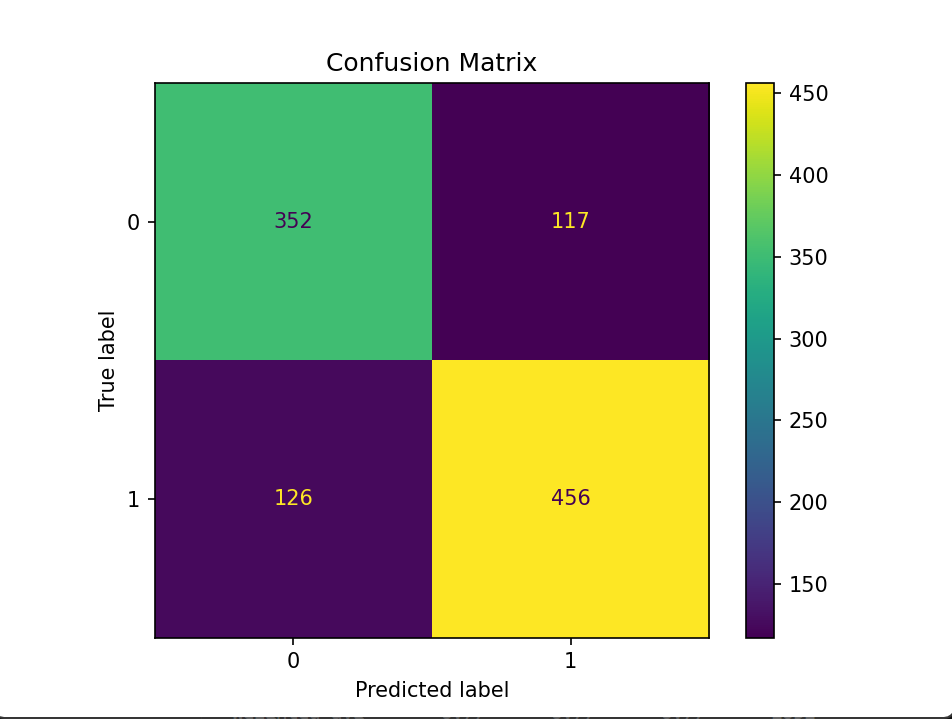
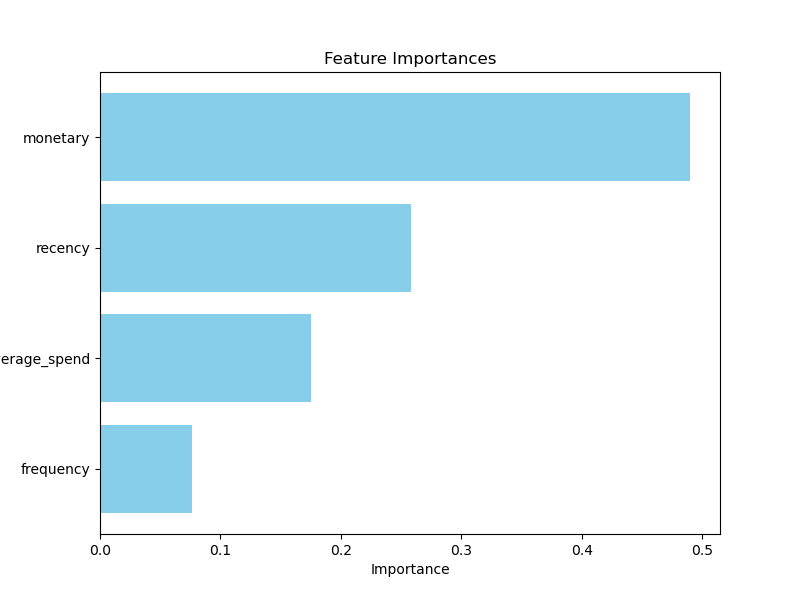

# Churn-Prediction.py

# Retail Customer Churn Prediction

This project explores customer churn prediction using real-world e-commerce transaction data. The goal is to identify customers at risk of leaving by analysing historical purchase patterns and behaviour.

**Note:** The main code is implemented in `churn_predictor.py`. 


# Project Overview

A constant challenge in retail and e-commerce is customer churn which is an ongoing challenge. By analysing past customer behaviour, we aim to:
- Define churn based on inactivity or reduced spend
- Use machine learning models to predict which customers are at risk
- Explore key factors like recency, frequency, and spend habits


## Approach and Methodology
  
1. **Data Loading:** Read raw transaction data from CSV.
2. **Data Cleaning:** Remove duplicate records, handle missing values, and filter invalid entries.
3. **Feature Engineering:** Generate features such as recency, frequency, monetary spend, and average spend based on purchase history.
4. **Model Building:** Use a Random Forest classifier with hyperparameter tuning and cross-validation.
5. **Evaluation:** Measure model accuracy, generate confusion matrix, and visualise key features.


##  Environment Setup

We use Conda to manage dependencies in an isolated environment.

### Step 1: Create a Conda Environment

```
conda create --name dspt python=3.10
```

### Step 2: Activate The Environment 


```
conda activate dspt
```

### Step 3: Install dependencies

After creating and activating your environment, install the necessary packages. You can install packages manually, or use the `requirements.txt` file 

Then run:

```bash
pip install -r requirements.txt
```

**Dataset Download:**
Please download the dataset from https://www.kaggle.com/datasets/mashlyn/online-retail-ii-uci/data. Save it as `online_retail_II.csv` in your project folder before running the scripts. The dataset used in this project is hosted externally due to its size. 


## Usage 

1. Place 'online_retail_II.csv' in your project directory
2. Run the main script:

```bash
python churn_predictor.py
```

   
## Expected Outputs

- Accuracy score and classification report printed in the terminal.
- Confusion matrix visualisation.
- Feature importance plot showing key predictors of customer churn.


## Results and Visualisation:

Below are key visualisations from the analysis:

### 1. Confusion Matrix


### 2. Feature Importance
 


## Notes: 
- Too regenerate visualisations, rerun the script.
- Adjust hyperparameters or features as needed.
- Ensure dataset file is correctly named and located.
- If you encounter issues with missing packages, ensure your environment is correctly set up and dependencies installed via `pip install -r requirements.txt`.


